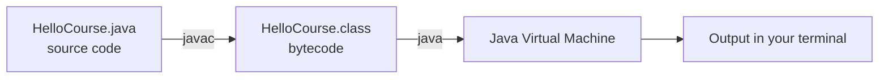
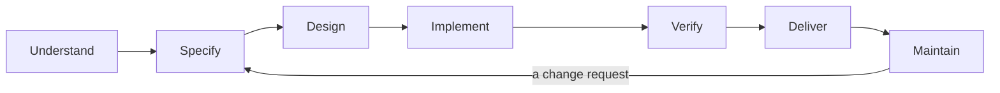
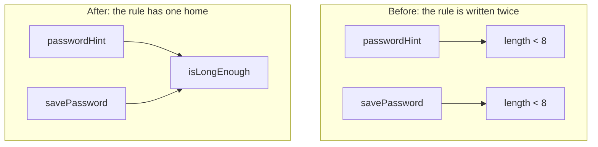
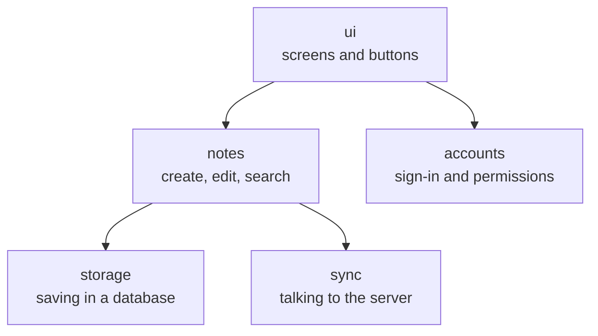
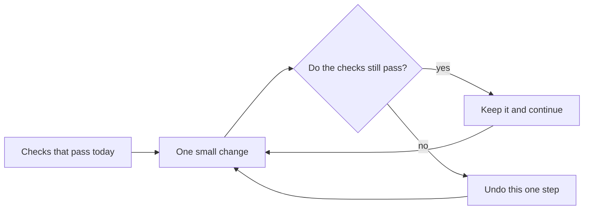
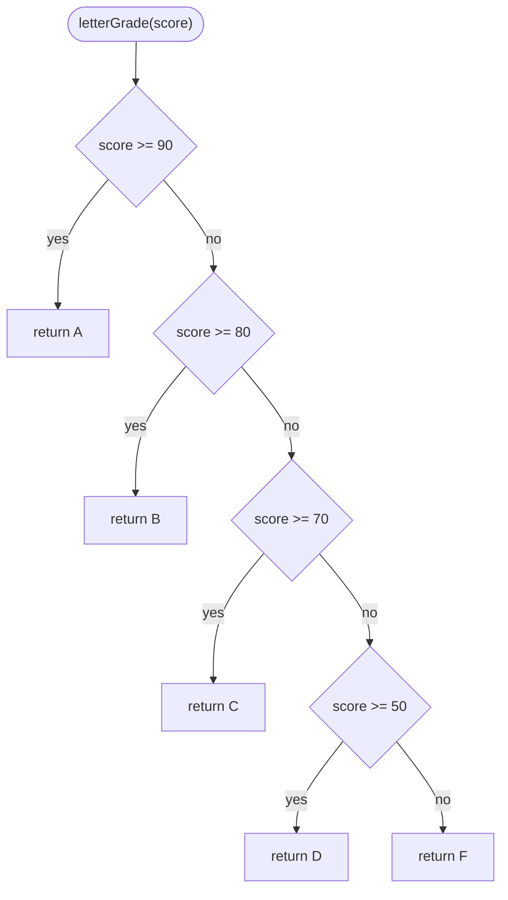

## Learning goals
{: #learning-goals }

By the end of this chapter, you should be able to:

- Explain how programming fits into the wider work of software engineering.
- Say how industry-strength software differs from a student program, and why productivity and quality drive every project.
- Talk about scope, cost, time, and quality, and say what makes a project hard to estimate.
- Compile and run a small Java program and explain what it does.
- Write clean code: clear names, small methods, useful comments, and the same conventions as your team.
- Remove repeated rules from a program and split a big problem into small parts.
- Improve code in small, safe steps (refactoring) without changing what it does.
- Calculate cyclomatic complexity, explain maintainability, and recognise common code smells.
- Take responsibility for your work, including code written with the help of AI.

**Starting point:** you have already written programs in some language. This chapter refreshes those skills in Java and shows just enough syntax to follow the examples. Classes and object-oriented design come in .

**How to read it:** the examples are small and independent. Each one shows one idea, so you can try it, change it, and break it on purpose. Downloading the files is enough for now: Git starts in .

## How this course works
{: #course-structure }

Over {{ site.data.weeks.size }} weeks, we follow software from "someone has a problem" to "a working program that other people can use and change". Every week has a chapter like this one and a lab. Lab instructions and assignments are in the SANGU LMS.

| Part | Topics |
| --- | --- |
| Foundations and tooling | Java refresher, clean code, Git, Maven |
| Understand and design | Requirements, planning, modular design |
| Verify and improve | Testing, debugging, refactoring, quality metrics, continuous integration |
| System and security | Architecture, secure construction |
| Deliver and operate | Docker, delivery pipelines, observability |

The clean-code ideas in this chapter come back later: as design principles in , as real tests in , and as automatic quality checks in .

## Set up your Java toolkit
{: #java-toolkit }

Do this first, so that any installation problem appears now and not in the middle of the semester. The examples use **Java 21 or newer**, with no extra libraries. Install a full **JDK** (Java Development Kit), not only a runtime. An IDE is comfortable, but a text editor and a terminal are enough.

- `javac` compiles a `.java` file into a `.class` file with bytecode.
- `java` starts the Java Virtual Machine (JVM), which runs the compiled program.



The source file is the part you edit; the class file is generated, so you never edit it. (The diagrams in this chapter are written as text and drawn by the browser. You will make your own in .)

The official [Java getting-started guide](https://dev.java/learn/getting-started/) explains the installation. After it, check that both commands answer:

```shell
java --version
javac --version
```

We compile by hand here, so that you can see what the compiler does. In , Maven will do it for you.

### Run a first program

Download [HelloCourse.java]({{ '/examples/week-01/HelloCourse.java' | relative_url }}) into a working folder:





Open a terminal in that folder and run:

```shell
javac HelloCourse.java
java HelloCourse
```

Expected output:





A public class and its file must have the same name, so `HelloCourse` lives in `HelloCourse.java`. For now, read `public static void main(String[] args)` as "the program starts here". The word `static` lets us call a method without creating an object; objects come later. `System.out.println` prints one line, and `+` joins text with other values.

> Look at `lectureWeeks * 2`. Two what? Coffees per week? Per lecture? We come back to this number when we talk about *magic numbers*.

### If the program does not run

| Symptom | Check first |
| --- | --- |
| `javac` is not recognised | Install a JDK and make sure your terminal can find its tools. |
| The file cannot be found | Check the current folder and the exact file name, including `.java`. |
| The compiler shows a syntax error | Go to the line it reports and look for a missing brace, quote, or semicolon. |
| Old output still appears | Save the file and compile it again before running. |

A step-by-step debugging method comes in .

## Programming is part of a bigger job
{: #engineering-software }

Imagine a small request: "write a program that shows which students passed the exam". The code looks simple, but the questions start at once. Is exactly 50 a pass? What should happen with an empty list, or with a score of 150? Who may see the results? What if the pass mark changes next year? Only the first question is arithmetic; the rest are about rules, people, and what happens later.

**Software engineering** is the work of understanding a problem, building software for it, checking that it really works, delivering it, and changing it over time, always with limited time and money. Programming is the part where decisions become something a computer can run.

Two words are worth keeping apart from the beginning:

- **Verification:** did we build the program *right*? Does it follow the rules we agreed on?
- **Validation:** did we build the *right* program? Do those rules actually help the people who asked?

A program can pass verification and fail validation: if the university wanted the students who may retake the exam, a perfect list of passing students is the wrong answer.

The work moves through the activities below. They are a vocabulary, not a straight line: one change request sends you back to the beginning.

| Activity | Example: "who passed the exam?" |
| --- | --- |
| Understand the problem | Ask the lecturer what "passed" means and who reads the result. |
| Specify | Write the rule down: a score of 50 or more is a pass. |
| Design | Decide which small methods you need and what each one does. |
| Implement | Write the Java code. |
| Verify | Check the difficult cases: 49, 50, an empty list. |
| Deliver | Give people the program and instructions for running it. |
| Maintain | Change it when the pass mark or the report format changes. |

The arrow back is the important part: software is never "finished", it is maintained.



We compare development processes, which organise these activities, in .

## Demo programs and industry-strength software
{: #industry-strength }

Here is a comparison from Pankaj Jalote's *A Concise Introduction to Software Engineering*, the second book of this course.

A student is asked to write a Java application of about 5,000 lines. Someone who programs well can finish it in a month of part-time work, which is about half a person-month of effort. That is a speed of roughly 10,000 lines per person-month.

Now give the same problem to a company that builds applications for clients. There a respectable speed is about 1,000 lines per person-month, so the same 5,000 lines take about five person-months — ten times the half person-month above. Fred Brooks's old rule of thumb says the same: the industrial version of a program costs about ten times more than the student version.

Are professional programmers ten times slower? No. They are building a different thing.

| | Demo or student software | Industry-strength software |
| --- | --- | --- |
| Purpose | Show that something works | Run a part of someone's work or daily life |
| Users | The author and the lecturer | People who did not write it and cannot read code |
| Written by | One person | A team, and later other teams |
| Lifetime | Until the deadline | Years, while it keeps changing |
| A bug means | A slightly lower grade | Lost money, lost time, sometimes danger |

Three things follow from the right-hand column, and they shape the whole course:

- **It is teamwork.** Large software is written by teams, so people must agree on conventions, review each other's code, and be able to work on different parts at the same time.
- **It lives a long time.** Over the life of a program, the effort spent changing it is several times bigger than the effort of writing it the first time. Software that was not built for change becomes expensive very quickly, which is why it must be split into modules that can be changed separately.
- **Other people read it.** Code you write today will be modified by someone else, or by you after you have forgotten everything about it. So it has to be easy to understand, not only easy to run.

The programs in this chapter are demo-sized, because small examples are the fastest way to learn. The habits in this chapter are for the other kind of software.

> Two more words you will meet: **system software**, such as operating systems, drivers, and compilers, sits between the hardware and the user, and **application software** is everything people choose to install and use. Applications can run on one machine, or be **distributed**, with a front end in a browser or phone and a back end on a server. Most software written today is distributed application software.

## Cost, time, and quality
{: #constraints }

Software is never written with unlimited resources. Every project balances four things:

| Concern | Question | Typical answer |
| --- | --- | --- |
| Scope | What exactly are we building? | Only the pass list, or also statistics and e-mails? |
| Time | When is it needed? | Before the exam session starts. |
| Cost | How much effort and money is available? | Two students, a few evenings, no budget. |
| Quality | What must be true of the result? | Correct results, clear output, easy to change. |

These four pull against each other. If the deadline and the team stay the same, new features must come from somewhere, and the usual "somewhere" is quality — a choice that is invisible at first and expensive later. The honest options are to **reduce the scope**, **move the deadline**, or **add resources**. Even the last one has a catch: Fred Brooks noticed that adding people to a late project often makes it later, because new people need training and everybody needs more coordination. Engineers say it as a joke: "fast, cheap, good — pick two".

### The two drivers: productivity and quality

Every project has two sides. The **consumers** — the client who pays and the users who work with the program — want high quality at a low price. The **producers**, you and your team, keep the price low by being productive. Jalote calls productivity and quality the two key drivers of a software project.

**Productivity** is output per unit of effort, usually thousands of lines of code (KLOC) per person-month. It is a rough measure: more lines are not better work, and it is unfair when applied to one person. Note also that what you *deliver* is not only what you *write*. If 40 of 50 thousand lines come from ready-made libraries, your delivered productivity is much higher than your typing speed.

**Quality** has many sides. The ISO standards describe eight characteristics: functionality, performance, reliability, usability, security, maintainability, compatibility, and portability. Projects give them different weights, but reliability usually comes first, and it is usually measured as **defect density**: the number of defects per 1,000 lines of delivered code. Good teams today stay under one defect per KLOC.

Three things improve productivity and quality at the same time:

- **Good processes and methods.** That is most of this course.
- **Reuse.** Open source libraries and frameworks give you code that is already written and already tested by many users, so you deliver more and add fewer defects. Check the licence: permissive licences such as MIT allow almost any use, while copyleft licences such as GPL require you to publish your own code under the same licence.
- **AI assistance.** Language models can produce code, tests, and explanations quickly, and a clear prompt with enough context makes a big difference. What they produce is still your responsibility; the [last section](#responsibility) of this chapter says what that means in practice.

### Estimating

An estimate is a prediction, not a promise. It is built from a few characteristics:

- **Size:** how much there is to build, measured in lines of code (easy to count, but it rewards long code), function points (how much functionality the user sees), or story points (a team's own relative sizes, covered in ).
- **Effort and duration:** person-hours of work, and calendar time. They are not the same thing: 40 hours of effort is not "ready tomorrow" just because five people are free.
- **Cost:** mostly effort multiplied by what people's time costs, plus tools and servers.
- **Uncertainty:** at the start of a project, estimates are often wrong by several times in both directions, and they improve as the requirements become clear. Steve McConnell calls this the *cone of uncertainty*.

### Change is normal

Requirements change: a new rule, a new report, a new idea from a lecturer. You cannot stop this, but you can make it cheap. The cost of a change depends mostly on **how many places in the code know about the thing that changed**. If the pass mark is written once, as `PASS_MARK`, a new rule costs one line. If the number `50` is copied into fourteen places, it costs fourteen edits — and one of them will be forgotten. This is the practical reason for everything else in this chapter.

## A quick Java refresher
{: #programming-foundations }

You have used these building blocks before. Here is how they look in Java.

### Values and variables

Every variable has a type. `int` holds a whole number, `boolean` holds `true` or `false`, and `String` holds text.

```java
int score = 87;
boolean passed = score >= 50;
String studentName = "Nino";
```

`=` stores a value. `==` compares two simple values such as `int`s. Careful: for `String`s, use `equals` instead of `==`.

### Methods, parameters, and return values

A method gives a piece of work a name. It can take input through parameters and give back a result with `return`:

```java
static boolean isPassing(int score) {
    return score >= 50;
}
```

`score` is the parameter. In the call `isPassing(87)`, the number 87 is the argument. The method *returns* an answer instead of printing it, so any part of the program can use that answer: to print a message, to count students, or to check the rule.

### Conditionals, arrays, and loops

`if` chooses whether a block runs. An *array* is a fixed-length sequence of values of the same type, and the enhanced `for` loop visits each value in order:

```java
int[] scores = {41, 50, 87};
int total = 0;
for (int score : scores) {
    total += score;
}
if (total > 200) {
    System.out.println("Strong group.");
}
```

An empty array means the loop body never runs, so `total` stays 0.

### Integer division

Dividing one `int` by another gives an `int`, and the rest is thrown away. `%` gives you that rest:

```java
int average = 178 / 3;   // 59, not 59.33
int remainder = 178 % 3; // 1
```

This is a classic source of wrong results that still compile.

## Example code: exam scores
{: #walkthrough }

Download [ExamScores.java]({{ '/examples/week-01/ExamScores.java' | relative_url }}). It is small on purpose: one rule, one loop, and one place that prints.





Compile and run it:

```shell
javac ExamScores.java
java ExamScores
```

Expected output:





Look at how the work is divided:

- `isPassing` answers one question about one score. It is the only place that knows the rule.
- `countPassing` walks through the scores and asks `isPassing` about each one. It does not compare numbers itself, so the rule cannot get out of step.
- `main` supplies the data and prints. No other method prints anything, so the other methods can be reused anywhere.

`PASS_MARK` is a **named constant**. `final` means the value can never be reassigned, and the name explains what the number means. The empty array in the last line shows a useful boundary: zero scores give zero passes, because the loop body never runs.

## Checking behaviour before you say "it works"
{: #checking-behaviour }

The compiler checks grammar, not meaning. This version compiles perfectly:

```java
static boolean isPassing(int score) {
    return score > PASS_MARK;
}
```

It is wrong. A student with exactly 50 now fails. Nothing crashes, nothing turns red; the program simply gives a wrong answer to one student. This is a **logic error**, and only a check can catch it.

Decide what you expect *from the rule*, before you look at what the program prints. Otherwise it is very easy to see a wrong result and think "ah, that is probably correct".

| Score | Expected result | Why |
| --- | --- | --- |
| 0 | `false` | Clearly below the pass mark. |
| 49 | `false` | One point below. |
| 50 | `true` | Exactly the pass mark is a pass. |
| 51 | `true` | One point above. |
| 100 | `true` | Clearly above. |

Notice which row matters most. Under both versions of the rule, 0, 49, 51, and 100 give the same answer. Only the row with 50 is different, and that is exactly the mistake a tired programmer makes. Good checks sit on **boundaries**: the values where a small mistake changes the answer.

In [Your turn](#your-turn) you make these checks runnable. Real automated tests arrive in , and test design in .

## What is clean code?
{: #clean-code }

Your program works. Is that enough? Open a project you wrote six months ago and try to change it. Most programmers have thought "who wrote this?" and then discovered that it was them.

**Clean code** is code that other people — including you next semester — can read, understand, and change without fear. In his book *Clean Code*, Robert C. Martin collects short definitions from famous programmers: Bjarne Stroustrup, who created C++, says clean code "does one thing well"; Grady Booch says it reads like well-written prose.

Why should you care, if the computer does not?

- **Code is read much more often than it is written.** Martin puts the ratio at more than 10 to 1. Every new line starts with reading old lines, so easy reading makes writing faster.
- **Mess slows everyone down.** A team can move fast for a few months and then almost stop, because every change breaks something else. Adding more people does not help: they do not know the design and add more mess.
- **Mess invites more mess.** *The Pragmatic Programmer* compares it to a broken window: once one window is broken, the building looks abandoned and nobody cares about the next one.
- **"I will clean it later" usually means never.** Martin quotes LeBlanc's law: *later equals never*.

Two habits follow from this:

> **The Boy Scout rule:** leave the code a little cleaner than you found it. Rename one unclear variable, split one long method, delete one copy. If everybody does this every time, code cannot slowly rot.

> **You are an author.** Your readers are your teammates, your reviewers, and you in six months. Write for them.

Clean code is not about beauty. It is about the cost of the *next* change, and there is always a next change.

## Code conventions
{: #conventions }

A **code convention**, or style guide, is a set of agreed rules about how code looks: names, braces, spaces, line length. Conventions do not make code correct. They make every file feel familiar, so a reader can think about the logic instead of the layout.

A popular convention for Java is the [Google Java Style Guide](https://google.github.io/styleguide/javaguide.html). The most important rules:

| Rule | Example |
| --- | --- |
| Class names are nouns in `UpperCamelCase`, and the file has the same name. | `ExamScores` in `ExamScores.java` |
| Method names are `lowerCamelCase`, usually verbs. | `isPassing`, `countPassing` |
| Variables and parameters are `lowerCamelCase`. | `passingCount`, not `passing_count` or `pc` |
| Constants (`static final`, never changing) are `UPPER_SNAKE_CASE`. | `PASS_MARK` |
| Short forms are written like normal words. | `XmlHttpRequest`, `customerId` (not `customerID`) |
| `if`, `else`, `for`, and `while` always use braces, even for one statement. | Never `if (isDone) stop();` |
| One statement per line, one variable per declaration. | Not `int a, b;` |
| Lines are not longer than 100 characters. | Break the line, or better, extract a method. |
| Local variables are declared where they are first used. | Not all together at the top of a method. |

> **A convention is a team decision, not a law of nature.** Google indents with 2 spaces; our examples use 4, which is the default in most IDEs. *Clean Code* likes wildcard imports such as `import java.util.*;`, while Google forbids them. Neither choice is wrong. What *is* wrong is mixing styles inside one project. A team chooses one guide, and a formatter applies it automatically, so nobody argues about spaces during code review.

## Names, methods, and comments
{: #readable-code }

### Names that tell the truth

A good name answers three questions: why does this exist, what does it do, and how is it used? If you need a comment to explain a name, the name is not ready.

```java
// Before: the comment does the work of the name
int d; // days since the student last logged in

// After: the name does its own work
int daysSinceLastLogin;
```

Compare two versions of the same method. They do exactly the same work:

```java
// Version 1: what does it count, and what is 50?
static int count(int[] list1) {
    int n = 0;
    for (int x : list1) {
        if (x >= 50) {
            n++;
        }
    }
    return n;
}

// Version 2: same code, names that explain it
static int countPassingScores(int[] scores) {
    int passingCount = 0;
    for (int score : scores) {
        if (score >= PASS_MARK) {
            passingCount++;
        }
    }
    return passingCount;
}
```

The structure did not change at all. Only the names did, and now the reader knows that the numbers are exam scores, that 50 is the pass mark, and that the result is a number of students.

A few rules of thumb:

- **Show the intention.** `score >= PASS_MARK` is clearer than `s >= p`, and `isGameOver` is clearer than `flag`.
- **Do not lie.** A method called `isAvailable` that only counts seats will confuse everyone who calls it.
- **Make differences meaningful.** `student1` and `student2`, or `data` and `info`, do not say how they differ; `currentStudent` and `nextStudent` do.
- **Use names you can say and search for.** Try reading `lstUpdTmstmp` out loud. And searching for `50` finds every 50 in the project, while `PASS_MARK` finds exactly what you need.
- **One word per idea.** If `fetchStudent`, `getGroup`, and `retrieveScore` do the same kind of work, readers look for a difference that does not exist.

**Magic numbers** are raw numbers whose meaning is not obvious — such as the `2` in `lectureWeeks * 2` in our first program. Give them names:

```java
int seconds = days * 86400;                    // before
int seconds = days * SECONDS_PER_DAY;          // after
```

Some numbers explain themselves: `radius * 2` does not need a constant called `TWO`.

### Small methods that do one thing

- **Small.** Martin's first rule for methods is that they should be small. His second rule is that they should be smaller than that. If a method does not fit on your screen, it probably does several things.
- **One thing.** If you can only describe a method with "and" — `validateAndSaveAndEmailOrder` — it is several methods with one name.
- **Few parameters.** Zero, one, or two are easy; three need a good reason. `createStudent("Nino", 21, 3, true, false, "IT")` is a guessing game.
- **No flag parameters.** `printReport(true)` tells the reader nothing; `printFullReport()` and `printShortReport()` tell them everything.
- **No hidden surprises.** A method called `isPasswordValid` that also creates a session does something its name does not mention. That is how bugs are born.
- **Separate calculating from printing.** `isPassing` returns a value and prints nothing, so a report, a counter, or a check can all use it.

### Comments that are worth reading

A comment should say what the code *cannot* say. Before you write one, try to make the code clear enough not to need it.

```java
// Bad: repeats the code
passingCount++; // increase the counter by one

// Bad: explains unclear code...
// check if the password is long enough
if (p.length() >= 8) { ... }

// ...so fix the code instead
if (isLongEnough(password)) { ... }

// Good: explains WHY, which the code cannot show
// The university rounds 49.5 up, so the rule uses >= and not >.
```

Good comments explain a reason, warn about a consequence, or mark agreed temporary work with a `TODO` and a link to an issue. Bad comments repeat the code, become lies after the code changes, or keep **commented-out code** alive "just in case". Delete that code: version control remembers it for you ().

## Don't repeat yourself
{: #duplication }

If the same rule lives in two places, sooner or later someone changes one of them and forgets the other. The **DRY** principle — *don't repeat yourself* — says that every rule should have exactly one home.

Here the minimum password length is written twice:

```java
static String passwordHint(String password) {
    if (password.length() < 8) {
        return "Your password is too short";
    }
    return "Looks good";
}

static void savePassword(String password) {
    if (password.length() < 8) {
        System.out.println("Rejected: too short");
    } else {
        System.out.println("Saved");
    }
}
```

Now the university asks for 12 characters. A developer updates `savePassword` and misses `passwordHint`. The screen says "Looks good" and the save button says "Rejected". The user tries again. And again.

The cure is one rule, one home:

```java
static final int MIN_PASSWORD_LENGTH = 8;

static boolean isLongEnough(String password) {
    return password.length() >= MIN_PASSWORD_LENGTH;
}

static String passwordHint(String password) {
    if (isLongEnough(password)) {
        return "Looks good";
    }
    return "Your password is too short";
}
```



`savePassword` asks `isLongEnough` in the same way. Now the rule changes in one line, and the condition has a name that explains it. Our `ExamScores` example uses the same idea: `countPassing` never compares numbers itself, it asks `isPassing`.

### Repetition or coincidence?

Not every pair of similar lines is duplication:

```java
static boolean canVote(int age) {
    return age >= 18;
}

static boolean paysAdultTicket(int age) {
    return age >= 18;
}
```

The code is the same, but the rules are different: one comes from election law, the other from a cinema price list. If the cinema moves its adult price to 16, voting must not change. Ask yourself: **if one changes, must the other change too?** If yes, it is duplication, so give it one home. If no, it is a coincidence, so leave it alone.

When you are not sure, use the **rule of three**: write it the first time, notice the repetition the second time, extract it the third time.

## Small modules
{: #modules }

Nobody writes a large system in one file. A large program is split into **modules**: parts with one clear job and a small, well-defined way to use them. For example, a simple notes application:



An arrow means "uses". Notice how few arrows there are: that is the goal.

Good modules have two properties, which you will study properly in :

- **High cohesion:** everything inside one module belongs together. Everything about saving lives in `storage`.
- **Low coupling:** a module knows as little as possible about the inside of other modules. If `storage` changes its database, `ui` should not notice.

Splitting helps immediately: you think about one part at a time, several people can work at once, and small parts are much easier to estimate. "How long will the whole app take?" is a guess; "how long will sign-in take?" has an answer.

How do you find the borders? Ask **what changes for different reasons**: screens change when designers change their minds, the database changes for technical reasons, so they belong to different modules. The same idea works at every size — a system into modules, a module into classes, a class into small methods. `ExamScores` already does it at the smallest size: two methods, two jobs, plus `main` for input and output.

## Refactoring
{: #refactoring }

**Refactoring** means improving the structure of code *without changing what it does*. The user sees no difference; the next programmer sees a big one. Martin Fowler's book *Refactoring* made the practice popular and describes many named refactorings.

Why not rewrite everything from the beginning? Because it is very hard to make a new version behave exactly like the old one, and the old one keeps changing while you work. Small steps are safer:

1. **Have checks** that show what the code does today.
2. **Make one small change:** rename, extract, or simplify.
3. **Run the checks.** If they pass, continue. If they fail, undo the last step — it was small, so this costs you nothing.
4. **Repeat** until the code is clean enough for your next task.



Two more rules: **do not refactor and add features at the same time**, so that when something breaks you know why; and **first make it work, then make it right**.

| Refactoring | What it does |
| --- | --- |
| Rename | Gives a variable, method, or class a name that tells the truth. |
| Extract method | Moves a piece of code into a method whose name explains it. |
| Replace magic number with constant | Turns `50` into `PASS_MARK`. |
| Remove flag parameter | Turns `printReport(true)` into two clearly named methods. |
| Replace nested conditionals with guard clauses | Returns early for special cases instead of nesting `if`s. |
| Remove dead code | Deletes code that nobody calls or that is commented out. |

Your IDE can do most of these for you. In IntelliJ IDEA, the **Refactor** menu has *Rename* (Shift+F6) and *Extract Method* (Ctrl+Alt+M on Windows and Linux), and they update every usage.

### One refactoring, step by step

A lecturer's program adds a bonus to an exam score. It works, and it is painful to read:

```java
// calculates
static int c(int s, int b, boolean f) {
    int r;
    if (f == true) {
        r = s + b * 2;
    } else {
        r = s + b;
    }
    if (r > 100) {
        r = 100;
    }
    return r;
}

// ...somewhere else in the program:
finalScore = c(score, 5, true); // true? true what?
```

First, write down what it does today, before touching anything:

| Score | Bonus | Doubled? | Expected result |
| --- | --- | --- | --- |
| 80 | 5 | no | 85 |
| 80 | 5 | yes | 90 |
| 98 | 5 | no | 100 (never above 100) |
| 98 | 5 | yes | 100 |

Now change one small thing at a time and run the checks after each step:

1. **Rename.** `c`, `s`, `b`, and `f` become `scoreWithBonus`, `score`, `bonus`, and `isEarlySubmission`. The comment `// calculates` says nothing, so it goes.
2. **Replace the magic numbers.** `2` becomes `EARLY_BONUS_MULTIPLIER` and `100` becomes `MAX_SCORE`.
3. **Simplify.** `isEarlySubmission == true` is just `isEarlySubmission`, and "add, but never go above the maximum" is exactly `Math.min`.
4. **Remove the flag parameter.** Instead of telling the method *how* to calculate the bonus, the caller passes the bonus it wants.

The result:

```java
static final int MAX_SCORE = 100;
static final int EARLY_BONUS_MULTIPLIER = 2;

static int doubleBonus(int bonus) {
    return bonus * EARLY_BONUS_MULTIPLIER;
}

static int scoreWithBonus(int score, int bonus) {
    return Math.min(MAX_SCORE, score + bonus);
}

// ...and the call now reads like a sentence:
finalScore = scoreWithBonus(score, doubleBonus(5));
```

The four checks give the same results as before. Nothing changed for the user; everything changed for the reader.

## Measuring code quality
{: #quality-metrics }

"This code feels messy" is a fine start, but engineers also like numbers they can compare. Use every metric as a **smoke alarm, not a judge**: it shows you where to look, not what to think. Tools that calculate these numbers automatically come in .

### Cyclomatic complexity

**Cyclomatic complexity** (CC) was introduced by Thomas McCabe in 1976. It counts how many independent paths go through a piece of code. For one method the recipe is simple:

> **CC = number of decision points + 1**

In Java, the decision points are `if`, `for`, `while`, `do`-`while`, every `case` of a `switch`, `catch`, the operator `?:`, and every `&&` or `||` inside a condition. A plain `else` adds nothing: it is the other side of an `if` you already counted. Tools count `&&`, `||`, and `switch` a little differently, so compare numbers from one tool.

```java
static String letterGrade(int score) {
    if (score >= 90) {   // +1
        return "A";
    }
    if (score >= 80) {   // +1
        return "B";
    }
    if (score >= 70) {   // +1
        return "C";
    }
    if (score >= 50) {   // +1
        return "D";
    }
    return "F";
}
```

Every `if` splits the flow, so the method has five ways out:



Four decision points give **CC = 5**. The number is useful twice: each path is a case the reader must keep in mind, and you need five test cases to walk all five paths — one score for each grade.

| Method | Decision points | CC |
| --- | --- | --- |
| `isPassing` | none | 1 |
| `countPassing` | one `for`, one `if` | 3 |
| the old `c` with the bonus | two `if`s | 3 |
| the new `scoreWithBonus` | none | 1 |
| `letterGrade` | four `if`s | 5 |

A common rule of thumb: 1–10 is simple, 11–20 is getting complicated, above 20 most teams refactor, and above 50 a method is practically impossible to test. McCabe suggested 10 as a sensible limit, and many tools warn above 10 by default.

CC has a blind spot: it counts paths, not how hard they are to read. Ten `if`s inside each other and ten `if`s one after another get the same CC, although the nested version is much harder to follow. This is why tools such as SonarQube also report *cognitive complexity*, which adds extra points for nesting.

### Maintainability

**Maintainability** means how easily developers can understand, fix, and change software. It is one of the eight quality characteristics listed earlier, and the standards split it further into modularity, reusability, analysability (can I understand it?), modifiability (can I change it safely?), and testability (can I check it?). Everything in this chapter is a way to improve it.

Some tools put it into one number, the **Maintainability Index** (MI), proposed by Paul Oman and Jack Hagemeister in 1992. Visual Studio uses this version:

```text
MI = max(0, (171 - 5.2 * ln(HV) - 0.23 * CC - 16.2 * ln(LOC)) * 100 / 171)
```

`HV` is the *Halstead volume*, which grows with the number of operators and operands in the code; `CC` is cyclomatic complexity; `LOC` is the number of lines. The result goes from 0 to 100, and higher is better. Visual Studio shows 20–100 as green, 10–19 as yellow, and 0–9 as red.

Do not memorise the formula. Remember its message — **length, branching, and a large vocabulary make code harder to maintain** — and its limits: it was fitted to industrial code in the early 1990s and knows nothing about names or tests, so a method full of variables called `x1` can still get a good score. Use it to watch trends, never as a grade.

### Code smells

A **code smell** is a surface sign that something deeper may be wrong. Kent Beck invented the term, Fowler's *Refactoring* made it famous, and chapter 17 of *Clean Code* lists dozens of them. A smell is not a bug and not proof — it is a reason to look closer. Most smells have a matching refactoring.

| Smell | How it smells | Usual fix |
| --- | --- | --- |
| Mysterious name | `int d;`, `String s2;`, `void doStuff()` | Rename |
| Long method | A 200-line `main` that reads input, calculates, and prints | Extract method |
| Duplicated code | The same password rule in two places | Extract a method or a constant |
| Magic number | `if (level > 42)` — why 42? | Named constant |
| Long parameter list | `createStudent("Nino", 21, 3, true, false, "IT")` | Fewer parameters, grouped values |
| Flag parameter | `printReport(true)` | Two methods with clear names |
| Deep nesting | `if` inside `if` inside `for` inside `if` | Guard clauses, extract method |
| Comment as perfume | A long comment that explains confusing code | Make the code clear, then delete the comment |
| Dead code | Methods nobody calls, `// oldCalc(x);` | Delete it; Git remembers |
| Large class | An `EverythingManager` with 3,000 lines | Split into modules |
| Shotgun surgery | One small change needs edits in many files | Put that knowledge in one place |

How do you learn to notice them? **Read the code aloud**: if you stumble or have to explain a name, something smells. Notice the **wish to write a comment**, which often means the code needs a better name or its own method. **Count the indentation levels**: more than two or three in one method is a warning. **Notice fear**: code you are afraid to change is usually tangled or unchecked. And ask a colleague — code review, which starts in , is the best smell detector.

## Professional responsibility
{: #responsibility }

Software decides who passes an exam, who gets a loan, and when a car brakes. This is why software engineering has a code of ethics. The [Software Engineering Code of Ethics and Professional Practice](https://www.acm.org/code-of-ethics/software-engineering-code) by the ACM and the IEEE Computer Society has eight principles. In short, software engineers should:

1. **Public:** act in the public interest.
2. **Client and employer:** serve them well, as long as this fits the public interest.
3. **Product:** make their products meet the highest professional standards they can.
4. **Judgment:** keep their professional judgment honest and independent.
5. **Management:** lead software work in an ethical way.
6. **Profession:** protect the reputation of the profession.
7. **Colleagues:** be fair to colleagues and support them.
8. **Self:** keep learning all their life.

What does this mean in normal work, even in a student project?

- **Be honest about what your program does.** If it only checks a rule, do not say that the result is official. Report bugs and limits clearly, with the input and the result you saw, so that another person can repeat it.
- **Say no when something is not possible.** *Clean Code* compares programmers with surgeons: if a patient asked a surgeon to skip washing their hands to save time, a professional would refuse, because they understand the risk better. Managers defend deadlines, and that is their job; explaining the real cost of cutting quality is yours.
- **Use only the data you need.** A pass list needs scores, not phone numbers or health information. Use invented data while you are learning.
- **Take responsibility for AI-generated code.** Where the course rules allow AI tools, you are still the author of what you submit. An AI that confidently writes `score > PASS_MARK` has still failed a student who got exactly 50. Read it, run it, check it, and write down where you used significant help. Never upload private data, credentials, or someone else's unpublished work.
- **Never say you checked something that you did not check.** "It works on my computer" is a starting point, not evidence.

## Check your understanding
{: #check-understanding }

Try to answer before you open the notes.

<details markdown="1">
<summary>Why does the same 5,000-line program cost about ten times more in a company than as a student project?</summary>

Because it is not the same product. The company version must work for people who did not write it, keep working for years, survive changes made by other programmers, and fail very rarely. The extra effort goes into understanding the requirements, design, review, testing, documentation, and making the code easy to change later.

</details>

<details markdown="1">
<summary>Why is a score of exactly 50 the most important check?</summary>

Because it is the boundary. The correct rule and the wrong rule with `>` give the same answer for every other score, so only this case shows the difference. Checks earn their place when a realistic mistake can make them fail.

</details>

<details markdown="1">
<summary>Why does isPassing return a boolean instead of printing a message?</summary>

Its job is to answer one question. When it returns the answer, other code can use it: to count students, to print a message, or to check the rule. If it printed, every caller would have to repeat the comparison somewhere else.

</details>

<details markdown="1">
<summary>A lecturer asks for three more features, but the deadline stays the same. What do you do?</summary>

Explain what it costs in effort, risk, and quality, and offer real choices: less scope now and the rest later, a later deadline, or more people (knowing that new people need time before they help). Agreeing silently and cutting quality only moves the problem into the future.

</details>

<details markdown="1">
<summary>A method has a cyclomatic complexity of 14. Is that bad code?</summary>

Not automatically, but it is worth a look. There are 14 paths to understand and 14 test cases to write. Check whether the method does more than one thing, whether the conditions could get names, and whether deep nesting could become guard clauses. The number tells you where to look, not what to conclude.

</details>

<details markdown="1">
<summary>Why refactor in small steps instead of rewriting a method at once?</summary>

If a check fails after a small step, you know exactly which change caused it, and undoing one small step is cheap. A big rewrite mixes many changes, so a failure can come from anywhere, and it is easy to change the behaviour without noticing.

</details>

## Your turn
{: #your-turn }

Do the exercises in order, in the folder with `ExamScores.java`. In each one, decide the expected results **before** you run anything. A solution is hidden under each exercise; try it yourself first.

### Make the checks runnable

Comparing output with a table by eye is slow, and it is easy to skip. Download [ExamScoreChecks.java]({{ '/examples/week-01/ExamScoreChecks.java' | relative_url }}) into the same folder. It calls the real `isPassing` method and prints PASS or FAIL for each case:





Compile both files together and run the checks:

```shell
javac ExamScores.java ExamScoreChecks.java
java ExamScoreChecks
```

Expected output:





1. Add a `check` call for every remaining row of the [expected-results table](#checking-behaviour). Compile and run again: every line should say PASS.
2. Change `>=` to `>` in `ExamScores.isPassing`, then compile and run the checks. Which line fails, and why only that one?
3. Change it back before you continue.

A program that compares results with expectations is the basic idea of automated testing. In , these checks become JUnit tests that Maven runs for you.

<details markdown="1">
<summary>Check your results</summary>

The three remaining rows:

```java
check(0, false);
check(51, true);
check(100, true);
```

With `>` instead of `>=`, exactly one line fails:

```text
PASS: isPassing(49) returned false, expected false
FAIL: isPassing(50) returned false, expected true
PASS: isPassing(0) returned false, expected false
PASS: isPassing(51) returned true, expected true
PASS: isPassing(100) returned true, expected true
```

Only the boundary case can see the difference between `>` and `>=`. This is also why checks with "nice" numbers such as 0 and 100 feel safe but prove very little.

</details>

### The pass mark moves to 55

The university changes the rule: a pass now starts at 55.

1. Update the expected results in `ExamScoreChecks` *before* you touch `ExamScores`. Which lines change? Add checks just below and just on the new boundary.
2. Run the checks against the unchanged program. The updated expectations should fail — that shows your checks now describe the new rule.
3. Change `ExamScores` and run the checks until every line passes. How many lines did you change? Run `ExamScores` again and explain every line of output that is different.

<details markdown="1">
<summary>One possible solution</summary>

The updated checks:

```java
check(49, false);
check(50, false);  // changed: 50 is no longer a pass
check(0, false);
check(51, false);  // changed
check(100, true);
check(54, false);  // just below the new pass mark
check(55, true);   // exactly the new pass mark
```

Against the old program, three of them fail: 50, 51, and 54. The program needs exactly one changed line:

```java
static final int PASS_MARK = 55;
```

Now every check passes, and `ExamScores` prints `Score 50: failed` instead of `passed`, so `Passing scores` drops from 3 to 2. One rule, one place, one line. If the number 50 had been copied into `isPassing`, into `main`, and into the checks, you would be hunting for it in three files — and the checks would not be able to catch a mistake, because they would contain the same copy.

</details>

### Clean up a smelly method

Download [ShippingCost.java]({{ '/examples/week-01/ShippingCost.java' | relative_url }}). It calculates the delivery price of a parcel in GEL. The parameters are the weight in grams, whether the customer wants express delivery, and whether the customer is a club member. It works, but it smells:





Expected output:





1. Write down every smell you can find. There are at least six.
2. Calculate the cyclomatic complexity of `cost`.
3. Before you change anything, write `ShippingChecks.java` with at least four checks. The interesting weights are 1000, 1001, 5000, and 5001.
4. Refactor in small steps and run your checks after each step. Then calculate the cyclomatic complexity again and compare.

<details markdown="1">
<summary>One possible solution</summary>

The smells: mysterious names (`cost`, `w`, `e`, `m`, `c`); magic numbers (1000, 5000, 5, 10, 20, 2); a comment that repeats the method name; `e == true` instead of `e`; nested `if`/`else` instead of a flat list of rules; commented-out code; a parameter `m` that nobody uses; and a flag parameter that makes the call `cost(500, true, false)` unreadable.

Cyclomatic complexity: three `if`s plus one, so **CC = 4**.

One possible clean version:

```java
static final int LIGHT_PARCEL_GRAMS = 1000;
static final int MEDIUM_PARCEL_GRAMS = 5000;
static final int LIGHT_PARCEL_COST = 5;
static final int MEDIUM_PARCEL_COST = 10;
static final int HEAVY_PARCEL_COST = 20;
static final int EXPRESS_MULTIPLIER = 2;

static int standardCost(int weightInGrams) {
    if (weightInGrams <= LIGHT_PARCEL_GRAMS) {
        return LIGHT_PARCEL_COST;
    }
    if (weightInGrams <= MEDIUM_PARCEL_GRAMS) {
        return MEDIUM_PARCEL_COST;
    }
    return HEAVY_PARCEL_COST;
}

static int expressCost(int weightInGrams) {
    return standardCost(weightInGrams) * EXPRESS_MULTIPLIER;
}
```

`main` now calls `standardCost(500)` and `expressCost(500)`, and prints the same four numbers as before. The checks can stay very simple, because each method now answers one question:

```java
static void check(String label, int actual, int expected) {
    String status = "FAIL";
    if (actual == expected) {
        status = "PASS";
    }
    System.out.println(status + ": " + label + " returned " + actual + ", expected " + expected);
}

public static void main(String[] args) {
    check("1000 g standard", ShippingCost.standardCost(1000), 5);
    check("1001 g standard", ShippingCost.standardCost(1001), 10);
    check("5000 g standard", ShippingCost.standardCost(5000), 10);
    check("5001 g standard", ShippingCost.standardCost(5001), 20);
    check("1000 g express", ShippingCost.expressCost(1000), 10);
}
```

The complexity dropped too: `standardCost` has CC 3 and `expressCost` has CC 1, because the express rule is no longer mixed with the weight rules. Both methods now have a name that says what they answer, and you can read the prices without counting braces.

</details>

## Summary and key terms
{: #summary }

- Software engineering is programming plus understanding, checking, delivering, and changing software with limited time and money.
- Industry-strength software is a different product from a student program: it is built by teams, lives for years, and must be of high quality, so it costs roughly ten times more.
- Productivity (delivered code per person-month) and quality (often measured as defects per KLOC) are the two drivers of a project. Good processes, reuse of open source libraries, and careful use of AI improve both.
- Scope, time, cost, and quality pull against each other. Talk about the trade-off instead of quietly cutting quality.
- Estimates are built from size, effort, duration, cost, and uncertainty. Change is normal, and its cost depends on how many places know about the thing that changed.
- Clean code means honest names, small methods that do one thing, comments that explain *why*, and one shared convention applied by a formatter.
- Every rule needs exactly one home, but similar code is not always duplication.
- Large programs are split into modules with high cohesion and low coupling.
- Refactor in small steps with checks after each step, never together with new features, and leave code cleaner than you found it.
- CC = decision points + 1, and 10 is a common limit. The Maintainability Index shows trends. Smells are hints, not verdicts.
- You are responsible for what you deliver, including code written with AI.

| English | ქართული |
| --- | --- |
| Cost, timeliness, quality | ღირებულება, დროულობა, ხარისხი |
| Project estimation | პროექტის შეფასება |
| Clean code | სუფთა კოდი |
| Code conventions | კოდის წერის კონვენციები |
| Code duplication | კოდის განმეორება |
| Professional ethics and responsibility | პროფესიული ეთიკა და პასუხისმგებლობა |
| Module | მოდული |
| Refactoring | კოდის ტრანსფორმაცია |
| Cyclomatic complexity | ციკლომატური სირთულე |
| Maintainability | კოდის შენარჩუნებადობა |
| Code smells | კოდის სუნები |

## Further reading
{: #further-reading }

- Robert C. Martin, *Clean Code: A Handbook of Agile Software Craftsmanship*, 2008 — the course's clean-code book. Chapters 1–5 cover this chapter's ideas; chapter 17 is a long list of smells.
- Martin Fowler, [Refactoring: Improving the Design of Existing Code](https://martinfowler.com/books/refactoring.html), second edition, 2018, and the free [catalogue of refactorings](https://refactoring.com/catalog/).
- [Google Java Style Guide](https://google.github.io/styleguide/javaguide.html) — the full set of conventions.
- Thomas J. McCabe, "A Complexity Measure", *IEEE Transactions on Software Engineering*, 1976 — the original paper on cyclomatic complexity.
- [Software Engineering Code of Ethics and Professional Practice](https://www.acm.org/code-of-ethics/software-engineering-code), ACM and IEEE Computer Society.
- Pankaj Jalote, [A Concise Introduction to Software Engineering: With Open Source and GenAI](https://link.springer.com/book/10.1007/978-3-031-74318-4), second edition, 2025 — chapter 1 covers industry-strength software, productivity and quality, open source reuse, and prompting.
- [Getting started with Java](https://dev.java/learn/getting-started/) and [Java language basics](https://dev.java/learn/language-basics/) — the official guides.
