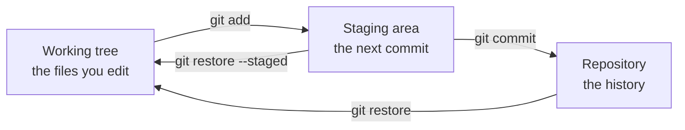
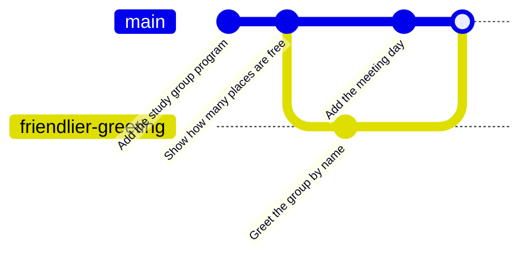
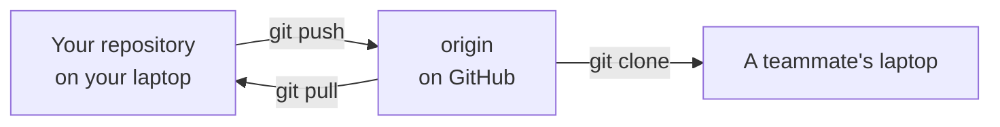
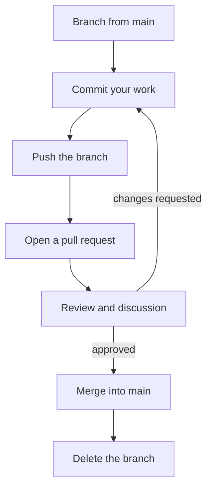

## Learning goals
{: #learning-goals }

By the end of this chapter, you should be able to:

- Explain what a version control system gives you that a folder of copies cannot.
- Set up Git once, correctly, on your own computer.
- Create a repository, stage changes, and record them as commits with useful messages.
- Read a history: what changed, when, by whom, and why.
- Undo an edit, a staged change, and a commit, and know which of the three you are undoing.
- Keep generated files and secrets out of a repository.
- Work on a branch, merge it, and resolve a merge conflict without fear.
- Push to GitHub, open a pull request, and review someone else's changes.
- Write an issue and a README that other people can actually use.

**Starting point:** you can write and run a small Java program (). No Git knowledge is assumed. Everything here happens in a terminal and in a browser, so an IDE is optional; most IDEs have a Git panel that runs exactly the same commands.

## Why version control
{: #why-version-control }

Every programmer meets this folder:

```text
ExamScores.java
ExamScores_old.java
ExamScores_final.java
ExamScores_final_FIXED.java
ExamScores_final_FIXED_use_this_one.java
```

It answers no useful question. Which file is the newest? What is different between two of them? Who wrote the change that broke the pass mark, and why did they do it? And when two people edit the program on the same evening, whose copy wins?

A **version control system** answers all four. Git records a sequence of snapshots of your project, each with an author, a time, and a message that explains why the change was made. From that history you can see what changed, compare any two versions, go back to a version that worked, and combine work done by several people.

Two words that are often confused:

- **Git** is the version control system. It runs on your computer and keeps the whole history locally, so you can commit, branch, and look at old versions with no network at all.
- **GitHub** is a website that hosts copies of Git repositories and adds collaboration tools around them: pull requests, reviews, issues. Other hosts, such as GitLab or Bitbucket, do the same job.

Git is also the first tool in this course that the rest of the course depends on. Later weeks build on it: automated tests run on every change (), a server checks every pull request (), and a pipeline releases what the history contains ().

## Set up Git once
{: #git-setup }

Install Git from [git-scm.com](https://git-scm.com/downloads), then check that your terminal can find it:

```shell
git --version
```

Now tell Git who you are and how you like it to behave. These settings are global, so you only do this once per computer:

```shell
git config --global user.name "Nino Beridze"
git config --global user.email "nino@sangu.edu.ge"
git config --global init.defaultBranch main
git config --global core.autocrlf true
```

| Setting | Why it matters |
| --- | --- |
| `user.name` and `user.email` | Every commit you make carries them. They are part of the history for ever, and they are public once you push to GitHub, so use your university address, not a private one. |
| `init.defaultBranch` | The first branch of a new repository is called `main`, which is what GitHub and this course use. |
| `core.autocrlf` | Windows ends lines with CRLF, macOS and Linux with LF. On Windows, `true` stores LF in the repository and gives you CRLF in your files; on macOS and Linux, use `input` instead. Without this, a whole file can look changed when nothing really changed. |

`git config --list --show-origin` prints every setting and the file it came from, which is the quickest way to find out why Git is behaving strangely on someone's laptop.

## Your first repository
{: #first-repository }

Download [StudyGroup.java]({{ '/examples/week-02/StudyGroup.java' | relative_url }}) into an empty folder, or use any small program of your own. Then turn the folder into a repository:

```shell
git init
```

That creates a hidden `.git` folder next to your files. It *is* the repository: the history, the branches, the settings. Your visible files are only the current version. Copy the folder and you copy the history with it; delete `.git` and the history is gone.

Git keeps your work in three places, and almost every command moves something between them:



The staging area is the part that surprises newcomers. It lets you choose *which* of your current edits go into the next commit, so one commit can contain one idea even when you have been working on three.

`git status` shows where everything is. Run it constantly; it is the compass of Git, and it tells you the command you probably want next.

```text
$ git status
On branch main

No commits yet

Untracked files:
  (use "git add <file>..." to include in what will be committed)
	StudyGroup.java

nothing added to commit but untracked files present (use "git add" to track)
```

*Untracked* means Git has never seen the file. Stage it, then look again:

```text
$ git add StudyGroup.java
$ git status --short
A  StudyGroup.java
```

`git status --short` is the version you will use every day: `A` for added, `M` for modified, `??` for untracked. Now record the snapshot:

```text
$ git commit -m "Add the study group program"
[main (root-commit) 7574243] Add the study group program
 1 file changed, 8 insertions(+)
 create mode 100644 StudyGroup.java
```

`7574243` is the beginning of the commit's identifier, a hash of its content, its author, its time, and the commit before it. Yours will be different, and that is fine: the hash is what makes a history tamper-evident, not a number you have to remember.

Now change the program. Add a named constant and a method, the way  suggests, so the program also says how many places are free:





Compile and run it as usual:

```shell
javac StudyGroup.java
java StudyGroup
```





## Seeing what changed
{: #diffs-and-history }

Before committing, look at what you actually did. `git diff` compares your files with the last commit:

```text
$ git diff
diff --git a/StudyGroup.java b/StudyGroup.java
index c69dd4b..f9fa191 100644
--- a/StudyGroup.java
+++ b/StudyGroup.java
@@ -1,8 +1,15 @@
 public class StudyGroup {
+    static final int MAX_MEMBERS = 6;
+
+    static int freePlaces(int memberCount) {
+        return MAX_MEMBERS - memberCount;
+    }
+
     public static void main(String[] args) {
         String[] members = {"Nino", "Luka", "Ana"};
 
         System.out.println("Study group: Software Engineering");
         System.out.println("Members: " + members.length);
+        System.out.println("Free places: " + freePlaces(members.length));
     }
 }
```

A diff is read line by line: `+` is a line you added, `-` a line you removed, and a line with a space is context that did not change. The `@@ -1,8 +1,15 @@` header says the hunk starts at line 1 and the file grew from 8 lines to 15.

There is a trap here. `git diff` shows what is *not yet staged*, so after `git add` it prints nothing at all, and beginners conclude that their changes are gone. They are staged. `git diff --staged` shows those:

```text
$ git add StudyGroup.java
$ git diff

$ git diff --staged
diff --git a/StudyGroup.java b/StudyGroup.java
...
```

Commit, then look at the history:

```text
$ git commit -m "Show how many places are free"
[main 60c1f51] Show how many places are free
 1 file changed, 7 insertions(+)

$ git log --oneline
60c1f51 Show how many places are free
7574243 Add the study group program
```

`git log` on its own prints the full entries with author, date, and message; `git log -p StudyGroup.java` adds the diff of every commit that touched one file; and `git show 60c1f51` prints a single commit. Reading history is most of what version control is for: months later, `git log` is how you find out why a line exists.

## Commits that tell a story
{: #good-commits }

A commit is not a save button. It is a unit of work that someone will read later, so two habits matter.

**One idea per commit.** If you fixed a bug and also renamed three variables, make two commits. When the bug turns out to be back, nobody wants to untangle it from a rename. Small commits are also easier to review and easier to undo.

**A message that explains.** The first line is a short summary in the imperative mood, as if completing the sentence "this commit will…", ideally under about 50 characters. If more is needed, leave a blank line and write why the change was made; what was done is already in the diff.

| Instead of | Write |
| --- | --- |
| `fix` | `Fix off-by-one in freePlaces` |
| `changes` | `Show how many places are free` |
| `asdf` | anything at all |
| `Updated StudyGroup.java` | `Reject groups larger than MAX_MEMBERS` |

The same rule as clean code applies, for the same reason: your reader is a teammate, a reviewer, or you in six months. And commit only code you have run; committing something that does not compile makes life hard for everyone who pulls it.

### Conventional Commits
{: #conventional-commits }

Many teams go one step further and give the subject line a fixed shape, so that a program can read it as well as a person. The widely used convention is [Conventional Commits](https://www.conventionalcommits.org/):

```text
<type>(<optional scope>): <summary>

<optional body: why the change was made>

<optional footer: BREAKING CHANGE: ..., Fixes #12>
```

In practice, the messages look like this:

```text
feat(study-group): refuse groups larger than MAX_MEMBERS
fix: count members correctly when the list is empty
docs: explain how to run the program in the README
refactor: extract freePlaces from main
chore: ignore compiled class files
```

| Type | Use it for |
| --- | --- |
| `feat` | a new capability for the user |
| `fix` | a corrected defect |
| `docs` | documentation only, such as the README |
| `refactor` | structure improved, behaviour unchanged () |
| `test` | adding or repairing tests () |
| `build`, `ci`, `chore` | the build, the pipeline, or housekeeping |

A change that breaks how people use the software is marked with an exclamation mark, `feat!: ...`, or a `BREAKING CHANGE:` footer explaining what to do instead.

The reason for the ceremony is what happens at release time. Because the type of every commit is machine-readable, a tool can collect the commits since the last release, group them under "Features" and "Bug Fixes", and write the **changelog** for you:

```markdown
## 1.3.0 (2026-10-13)

### Features

* **study-group:** refuse groups larger than MAX_MEMBERS (a1b2c3d)

### Bug Fixes

* count members correctly when the list is empty (4e5f6a7)
```

The same information decides the next version number under [semantic versioning](https://semver.org/): a `fix` raises the patch number, a `feat` the minor number, and a breaking change the major one. Tools that do this include **conventional-changelog** and **standard-version**, **semantic-release**, which also publishes the release, and **git-cliff**. Two more help on the way in: **commitizen** asks questions and writes the message for you, and **commitlint** rejects messages that do not follow the convention, which a pipeline can enforce (). Releases and versioning themselves come in .

A word of caution. The convention tells a machine *what kind* of change this is; it does not tell a human *why* you made it. `fix: correct the pass mark` is still a poor message if the body does not say that the university moved the boundary. Adopt the convention as a team, or not at all: half a history in one style is worse than a consistent history in either.

## Undoing things
{: #undoing }

Most Git fear comes from not knowing which of the three places you are undoing. Match the situation to the command:

| I want to | Command | Note |
| --- | --- | --- |
| throw away my edits to a file | `git restore StudyGroup.java` | The edits are gone; Git never saw them. |
| unstage a file but keep the edits | `git restore --staged StudyGroup.java` | Moves it back from the staging area. |
| fix the message or content of the last commit | `git commit --amend` | Only if you have not pushed it yet. |
| undo a commit that others may already have | `git revert 60c1f51` | Makes a new commit that reverses the old one, so history stays honest. |
| look at an old version of a file | `git show 7574243:StudyGroup.java` | Prints it; nothing changes. |

Two rules keep you out of real trouble. **Do not rewrite history that other people have pulled** — amending or rebasing a published commit forces everyone else to repair their copy; `git revert` is the polite alternative. And treat `git reset --hard` as a sharp knife: it discards uncommitted work permanently. Anything you have committed, though, is recoverable, which is the everyday reason to commit often.

This is also the answer to a rule from : delete commented-out code instead of keeping it "just in case". The history keeps it for you.

## What does not belong in a repository
{: #gitignore }

A repository holds sources: the files a human wrote. It should not hold:

- **Generated files.** `*.class` files, and later the `target/` folder that Maven produces (). They change on every build, conflict constantly, and anyone can regenerate them.
- **Editor and operating-system clutter.** `.idea/`, `.DS_Store`, `Thumbs.db`.
- **Large binaries.** Git keeps every version of everything for ever.
- **Secrets.** Passwords, API tokens, private keys. Once pushed, treat a secret as leaked and replace it: deleting it in a later commit does not remove it from the history.

List the patterns in a file called `.gitignore` in the root of the repository:

```text
*.class
target/
.idea/
.DS_Store
```

Ignored files simply stop appearing:

```text
$ git status --short
?? StudyGroup.class

$ git status --short
?? .gitignore
```

The `.gitignore` file itself belongs in the repository, so that everyone on the team ignores the same things. One catch: ignoring works only for files Git does not already track. If a `.class` file is already committed, remove it with `git rm --cached StudyGroup.class` and then commit the removal. When a file is ignored and you do not know which rule did it, ask: `git check-ignore -v StudyGroup.class`.

## Branches
{: #branches }

A **branch** is a movable label that points at a commit. Making one costs nothing: no copying, no new folder. You use branches so that unfinished work never sits on `main`, which everyone else is using.

```shell
git switch -c friendlier-greeting
```

That creates the branch and moves you to it. `git switch main` goes back, `git branch` lists what exists, and `git branch -d friendlier-greeting` deletes a branch after its work is merged. (In older material you will see `git checkout -b`, which does the same thing; `switch` was added later because `checkout` did too many different jobs.)

Name a branch after the change, not after yourself: `fix-pass-mark`, `add-free-places`. One topic per branch, and keep its life short — a branch that lives for three weeks is a merge problem waiting to happen.



## Merging, and conflicts
{: #merging }

Merging brings the commits of one branch into another. You switch to the branch that should receive the work and merge the other one into it:

```shell
git switch main
git merge friendlier-greeting
```

If `main` has not moved since the branch started, Git simply slides the label forward: a **fast-forward**, with no extra commit. If both branches have new commits, Git makes a **merge commit** with two parents, and the graph shows what happened.

Most merges are automatic. Git only asks for help when the two branches changed **the same lines** of the same file — a **merge conflict**. It is not an error and not a failure; it is Git refusing to guess which version you meant.

```text
$ git merge friendlier-greeting
Auto-merging StudyGroup.java
CONFLICT (content): Merge conflict in StudyGroup.java
Automatic merge failed; fix conflicts and then commit the result.

$ git status
On branch main
You have unmerged paths.
  (fix conflicts and run "git commit")
  (use "git merge --abort" to abort the merge)

Unmerged paths:
  (use "git add <file>..." to mark resolution)
	both modified:   StudyGroup.java
```

Open the file. Git has put both versions in it, between markers:

```text
<<<<<<< HEAD
        System.out.println("Study group: Software Engineering (Mondays)");
=======
        System.out.println("Welcome to the Software Engineering study group!");
>>>>>>> friendlier-greeting
```

Between `<<<<<<<` and `=======` is the version on the branch you are on; between `=======` and `>>>>>>>` is the version being merged in. Resolving means deciding what the file should say — one side, the other, or a combination — and deleting all three marker lines:

```java
        System.out.println("Welcome to the Software Engineering study group! We meet on Mondays.");
```

Then compile and run the program, because a file that merges cleanly can still be wrong. Finally tell Git you are done:

```shell
git add StudyGroup.java
git commit
```

```text
$ git commit --no-edit
[main e03f12f] Merge branch 'friendlier-greeting'

$ git log --oneline --graph
*   e03f12f Merge branch 'friendlier-greeting'
|\
| * cd6a5b2 Greet the group by name
* | ba949e9 Add the meeting day to the title
|/
* 5ef2bb0 Ignore compiled class files
* 60c1f51 Show how many places are free
* 7574243 Add the study group program
```

If it all goes wrong, `git merge --abort` puts everything back the way it was before you started. Conflicts get rarer when branches are small, when people agree who works on what, and when you merge `main` into your branch regularly instead of once at the end.

## GitHub: the repository on a server
{: #github }

A **remote** is another copy of the same repository, usually on a server, with a short name. The default name for the main one is `origin`.



There are two ways to start. If the project already exists on GitHub, copy it with `git clone <url>`, which downloads the history and sets up `origin` for you. If you started locally, create an empty repository on GitHub and connect it:

```shell
git remote add origin https://github.com/<user>/study-group.git
git push -u origin main
```

`-u` remembers the connection, so later `git push` and `git pull` need no arguments. `git pull` is really two steps: `git fetch` downloads new commits, and a merge brings them into your branch. When a push is rejected because the remote has commits you do not have, pull first, merge, and push again.

GitHub asks who you are when you push. Use HTTPS with a personal access token, which your operating system's credential manager stores after the first push, or set up an SSH key; both are described in the [GitHub documentation](https://docs.github.com/en/get-started/getting-started-with-git/set-up-git). A token is a password: never paste it into a file, a commit, a message, or a screenshot.

## Pull requests
{: #pull-requests }

A **pull request** is not a Git command; it is how GitHub proposes and discusses a merge. The flow is always the same:



Working this way has a point beyond ceremony: `main` keeps working while unfinished work sits on branches, and every change gets a second pair of eyes before it lands.

A pull request that is easy to review is small, covers one topic, and has a description that answers three questions: what changes, why, and how the reviewer can check it. A useful shape:

```markdown
## What
Reject groups with more members than `MAX_MEMBERS`.

## Why
The desk staff can currently register a seventh member, and the program
prints "Free places: -1". Fixes #12.

## How to check
`javac StudyGroup.java && java StudyGroup` prints "Free places: 3".
Adding a fourth member to the array still works; adding a seventh
prints the new message.
```

Open it as a **draft** while you are still working, so people know not to review yet. When GitHub offers "Squash and merge", it combines the branch's commits into one on `main`; that is a reasonable default for a small change with messy intermediate commits. Delete the branch after merging — the history stays in `main`.

## Code review
{: #code-review }

Review is where a team's standards actually live. Its purpose is not to catch a programmer out; it is to keep the code understandable by more than one person, and to spread knowledge about how the system works.

As a reviewer, read for these, in this order:

1. **Does it do what it says?** Compare the description with the diff, and look for cases the change forgets: an empty list, a boundary, an unexpected input ().
2. **Can I understand it?** Names that tell the truth, small methods, comments that explain why.
3. **Is anything repeated?** The same rule in two places is tomorrow's bug.
4. **Is it checked?** Ask how the author verified it. Real tests arrive in .
5. **Anything obviously risky?** Secrets, deleted checks, huge files.

Write comments about the code, not the person, and be specific: "this returns 0 for an empty array — is that what we want?" helps; "this is wrong" does not. Distinguish what must change from what you would merely prefer; a quick "nit:" prefix does that honestly. If a discussion goes past three rounds, talk in person and record the conclusion in the pull request.

As an author, review your own diff before asking anyone else. Reply to every comment, even if only to say you disagree and why. Getting review comments is not criticism of you, and it is much cheaper than finding the same problem after release.

## Issues
{: #issues }

An **issue** is a numbered note on a repository: a bug, a task, a question. It gives a problem one place to live, so it is not spread across three chats and somebody's memory.

A bug report worth reading has four parts: what you did, what you expected, what happened instead, and how to reproduce it. "It doesn't work" costs a day; "running `java StudyGroup` with seven members prints `Free places: -1`, and I expected it to refuse" costs a minute.

Issues and code connect through numbers. Mentioning `#12` in a commit message or pull request links them; writing `Fixes #12` in the pull request description closes the issue automatically when it is merged. Labels (`bug`, `documentation`), assignees, and milestones organise the list. Turning issues into a plan — backlogs, boards, priorities — comes in .

## Markdown and the README
{: #markdown }

Markdown is plain text with a few marks that GitHub renders as formatting. You need very little of it:

| Markdown | Result |
| --- | --- |
| `## Heading` | a section heading |
| `**bold**`, `*italic*` | **bold**, *italic* |
| `- item` | a bullet list |
| `1. item` | a numbered list |
| `` `code` `` | `code` inside a sentence |
| ```` ```java ... ``` ```` | a code block with Java highlighting |
| `[text](https://example.com)` | a link |
| `- [ ] task` | a task that can be ticked |

The `README.md` in the root of a repository is the first thing a visitor sees, because GitHub renders it under the file list. For a student project, four short sections are enough:

```markdown
# Study group

A small Java program that prints a study group's members and free places.
Written for week 2 of SANGU Software Engineering.

## Run it

Needs JDK 21 or newer:

    javac StudyGroup.java
    java StudyGroup

## Files

- `StudyGroup.java` — the program
- `.gitignore` — keeps compiled `.class` files out of the repository

## Status

Works. Next: refuse groups larger than six members (issue #12).
```

Write it for someone who has never seen the project and wants to run it in two minutes. The same file is also where you record the decisions you would otherwise forget. Diagrams can go straight into Markdown too: GitHub renders Mermaid inside a fenced block, which is how the diagrams in this chapter are drawn, and  teaches you to write them.

## Habits that keep a team out of trouble
{: #team-habits }

- **Pull before you start, and before you push.** Most conflicts come from working on top of an old copy.
- **Commit small and often; push at least daily.** Work that exists only on your laptop is work nobody can help with, and a lost laptop is a lost semester.
- **One topic per branch, and merge it soon.** Long branches drift away from `main`.
- **Never commit generated files or secrets.** See [above](#gitignore); both are painful to remove later.
- **Keep `main` working.** Compile and run before you push. From , a server will check this for you on every pull request.
- **Agree the conventions once.** Branch naming, commit style, who reviews what. The same argument as code conventions in : the point is that everything looks the same, not that your favourite won.

## Check your understanding
{: #check-understanding }

Try to answer before you open the notes.

<details markdown="1">
<summary>What is the staging area for, if Git could simply commit every change?</summary>

It lets you choose what goes into the next commit. You may have fixed a bug and renamed a variable in the same session; staging the two separately gives two commits, each with one idea and one message. It is also the place where you review your own change: `git diff --staged` is the last look before it becomes history.

</details>

<details markdown="1">
<summary>Why should compiled `.class` files stay out of the repository?</summary>

They are generated from the sources, so they add nothing that cannot be rebuilt, they change on every compilation, and they cause conflicts that mean nothing. A repository holds what humans wrote.

</details>

<details markdown="1">
<summary>A merge stops with "CONFLICT (content)". What has Git actually told you?</summary>

That both branches changed the same lines of the same file, so it will not guess which version is right. Nothing is broken and nothing is lost. You edit the file, delete the markers, run the program, `git add` it, and commit — or run `git merge --abort` and start again.

</details>

<details markdown="1">
<summary>What is a branch, physically?</summary>

A movable label pointing at one commit. Creating a branch writes a file with a hash in it; it does not copy your project. That is why branching is cheap and why a branch that is merged and deleted leaves its commits in the history.

</details>

<details markdown="1">
<summary>You committed a password, noticed, and deleted it in the next commit. Is the problem solved?</summary>

No. The old commit still contains it, and if the branch was pushed, others may have it too. Treat the password as leaked: change it. Removing it from history is possible but awkward, which is the reason for `.gitignore` and for keeping secrets out of the project from the start.

</details>

<details markdown="1">
<summary>Why open a pull request for your own repository, when you could push straight to `main`?</summary>

Because it separates "finished" from "in progress", gives the change a description and a place to discuss it, and gives someone else the chance to read it before it reaches the branch everyone uses. It also leaves a record of why the change was accepted, which the commit alone does not.

</details>

## Your turn
{: #your-turn }

Do the exercises in order. Everything here happens in your own repository, so mistakes are cheap.

### A repository with a history

Take the programs you wrote for  and put them under version control.

1. `git init` in the folder, and add a `.gitignore` that ignores `*.class`.
2. Make at least three commits, each with one idea and a message in the imperative mood. Compile and run before each commit.
3. Write one of the messages in the [Conventional Commits](#conventional-commits) form, for example `feat: show how many places are free`, and decide whether you would want the whole history in that style.
4. Run `git log --oneline`, then `git show` on the middle commit. Can you tell what changed and why, six months from now?
5. Change one file, look at `git diff`, and then undo the change with `git restore`. Now change it again, stage it, and unstage it with `git restore --staged`.

<details markdown="1">
<summary>What a reasonable history looks like</summary>

```text
$ git log --oneline
5ef2bb0 Ignore compiled class files
60c1f51 Show how many places are free
7574243 Add the study group program
```

Three commits, three ideas, three messages that say what the commit does. If your messages read "work", "more work", and "final", rewrite them while they are still local: `git commit --amend` fixes the last one.

</details>

### A branch and a conflict, on purpose

Conflicts are much less frightening once you have caused one deliberately.

1. On `main`, make sure everything is committed. Create a branch: `git switch -c friendlier-greeting`.
2. On the branch, change the line that prints the group's title, and commit.
3. Switch back to `main` and change **the same line** differently. Commit that too.
4. Merge the branch into `main` and read what Git says. Open the file, resolve the conflict so that the result keeps what matters from both sides, compile, run, `git add`, and commit.
5. Look at `git log --oneline --graph`.

<details markdown="1">
<summary>What you should see, and what to do with it</summary>

The merge stops and the file contains both versions:

```text
<<<<<<< HEAD
        System.out.println("Study group: Software Engineering (Mondays)");
=======
        System.out.println("Welcome to the Software Engineering study group!");
>>>>>>> friendlier-greeting
```

A resolution that keeps both intentions:

```java
        System.out.println("Welcome to the Software Engineering study group! We meet on Mondays.");
```

After `git add` and `git commit`, the graph shows the two lines of work joining:

```text
*   e03f12f Merge branch 'friendlier-greeting'
|\
| * cd6a5b2 Greet the group by name
* | ba949e9 Add the meeting day to the title
|/
* 5ef2bb0 Ignore compiled class files
```

</details>

### A pull request and a review

1. Create an empty repository on GitHub, connect it as `origin`, and push `main`.
2. Open an issue describing one improvement to the program — for example, that a group of seven prints `Free places: -1`.
3. Branch, make the change, push the branch, and open a pull request whose description says what, why, and how to check it. Write `Fixes #1` so the issue closes on merge.
4. Review a classmate's pull request with the checklist from [Code review](#code-review): leave at least one question about behaviour and one about readability. Then merge your own after their review, and delete the branch.
5. Add a `README.md` so that a visitor can run the program without asking you.

<details markdown="1">
<summary>Two review comments worth copying</summary>

> `freePlaces` returns a negative number when the group is larger than `MAX_MEMBERS`. Should it refuse instead, the way `ExamScores` refuses an impossible score? A comment here would also work, but the check reads better.

> nit: `memberCount` says what it is, but the variable in `main` is called `members` and holds names. Could the parameter be `memberNames.length` at the call site, or the array renamed to `memberNames`?

Both are specific, both are about the code, and the second is marked as a preference rather than a requirement.

</details>

## Summary and key terms
{: #summary }

- A version control system records snapshots with an author, a time, and a reason, so you can see what changed, compare versions, go back, and combine work from several people.
- Git is the tool and works entirely on your computer; GitHub is a host that adds pull requests, review, and issues.
- Work moves between three places: the working tree, the staging area, and the repository. `git status` tells you where you are.
- A commit holds one idea and a message written for the person who reads it later. Conventional Commits add a machine-readable type, so tools such as semantic-release or git-cliff can write the changelog and pick the next version number at release time.
- Choose the undo that matches the place: `restore` for files and staging, `--amend` for the last local commit, `revert` for anything published.
- Generated files and secrets do not belong in a repository; `.gitignore` keeps them out.
- A branch is a cheap label. Merge often, and treat conflicts as a question from Git, not a failure.
- Pull requests keep `main` working and give every change a reader; review looks for correctness, clarity, duplication, and evidence.
- Issues and a README are part of the code: they carry what the source cannot say.

| English | ქართული |
| --- | --- |
| Version control system (VCS) | ვერსიების კონტროლის სისტემა |
| Local repository | ლოკალური საცავი |
| Remote repository | დისტანციური საცავი |
| Staging changes | ცვლილებების ინდექსაცია |
| Commit | ცვლილებების შენახვა (commit) |
| Branching | განტოტვა (branches) |
| Merging branches | ტოტების შეერთება |
| Merge conflict | კონფლიქტი ტოტების შეერთებისას |
| Pull request | Pull Request |
| Code review | კოდის მიმოხილვა |
| Issue | საკითხი (issue) |
| Changelog | ცვლილებების ჟურნალი (changelog) |

## Further reading
{: #further-reading }

- Scott Chacon and Ben Straub, [Pro Git](https://git-scm.com/book/en/v2), second edition — free online. Chapters 1–3 cover everything in this chapter, in more depth.
- [GitHub Docs: Get started](https://docs.github.com/en/get-started) — accounts, authentication, repositories, and pull requests.
- [Oh Shit, Git!?!](https://ohshitgit.com/) — short recipes for getting out of the situations everybody hits.
- [GitHub's guide to reviewing changes](https://docs.github.com/en/pull-requests/collaborating-with-pull-requests/reviewing-changes-in-pull-requests) and Google's [code review developer guide](https://google.github.io/eng-practices/review/).
- [Markdown on GitHub](https://docs.github.com/en/get-started/writing-on-github/getting-started-with-writing-and-formatting-on-github/basic-writing-and-formatting-syntax) — the full syntax, including task lists and tables.
- [Conventional Commits](https://www.conventionalcommits.org/) and [Semantic Versioning](https://semver.org/) — the message convention and the numbering it feeds, with [semantic-release](https://semantic-release.gitbook.io/) and [git-cliff](https://git-cliff.org/) as examples of tools that turn one into a changelog.
